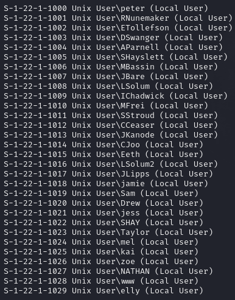
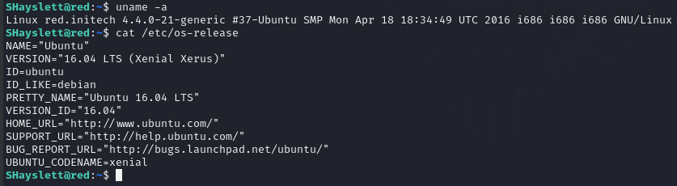
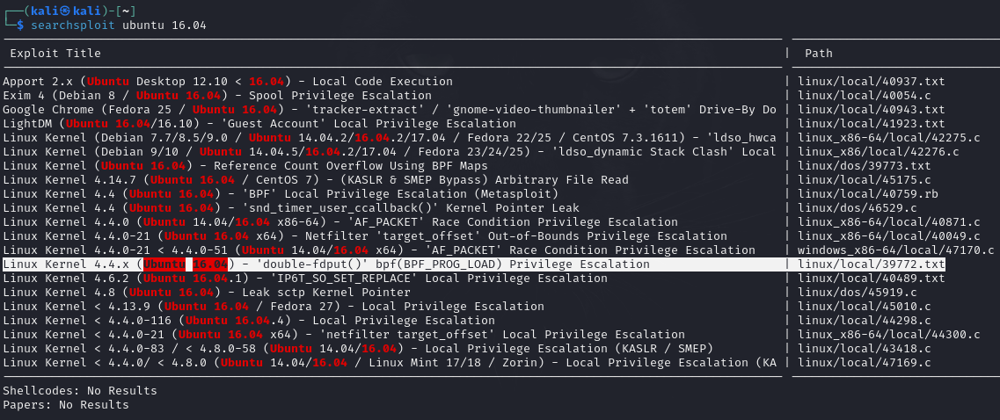
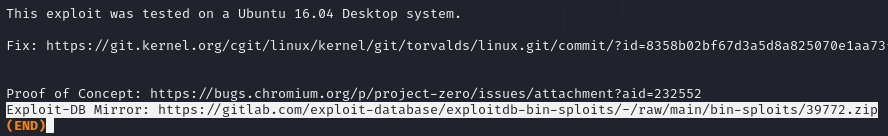
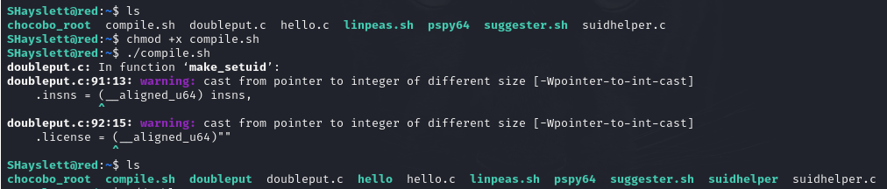
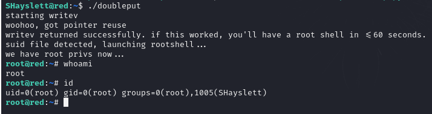

<b>This is a walkthrough of Stapler, an intentionally vulnerable machine from Vulnhub</b>
This is a fairly easy challenge, and I've left out any unnecessary steps. These are the steps I used to go from no access, to a foothold, to root (privilege escalation).

A standard port scan shows several open ports on this machine:

There's a lot to dig into here, but let's check the SMB ports first (these sometimes give up a lot of juicy info).

If we run enum4linux against the target, it returns a lot of information we can use.
We get information about services running on the target, the workgroup name, available shares, and user IDs / SIDs. We'll put these to use in our next step.

We can use grep and cut to extract the usernames to a users file, then use that file with Hydra to attempt to discover ssh credentials. Using -e nsr we're telling Hydra to try the username as the password, try an empty password, and try the username in reverse as the password (no wordlists needed).

We have a set of credentials for SSH, so let's put them to use.

We SSH onto the target. Let's take a look at what this machine is running in terms of OS and kernel versions.

Back over to Kali, let's see if we can find a usable exploit for this OS version.

We'll focus on 39772, which allows unprivileged code to execute via the bpf() syscall.

If we read the exploit, there's a link at the bottom. We need to paste this into our browser to download all of the files needed for the exploit.

We can use Apache or start another simpleHTTP web server on our machine and use wget on the terget to pull over the archive, where we can then unzip it and run the exploit.

Once we have the file on our target machine, we need to add executable permissions to the compile.sh file (otherwise we will not be able to run it). Once that is complete, we can run this file to compile the exploit.

doubleput is the file we're looking for here, this contains the exploit. All we have to do now is execute this binary and after a few seconds the binart is able to get a pointer. About a minute after writenv is returned we have root access on the target.

