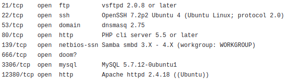
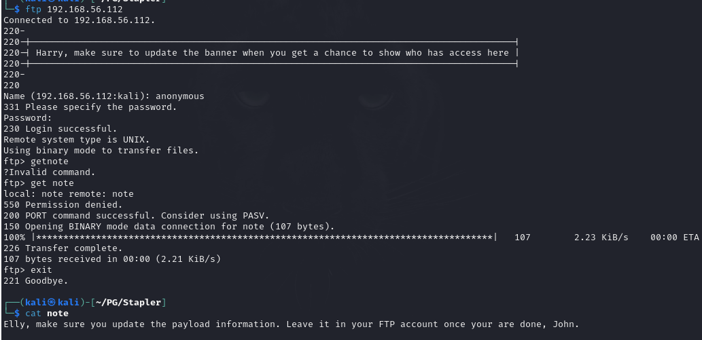

<b>This is a walkthrough of Stapler, an intentionally vulnerable machine from Vulnhub</b>

A standard port scan shows several open ports on this machine:

There's a lot to dig into here, but let's grab the low hanging fruit first.

Anonymous FTP is my first choice. Can you log in anonymously? If so, what will we find stored on this server.
Let's see.

I found a note file on the server, which provides me with a couple of usernames (Elly and John).

ports
