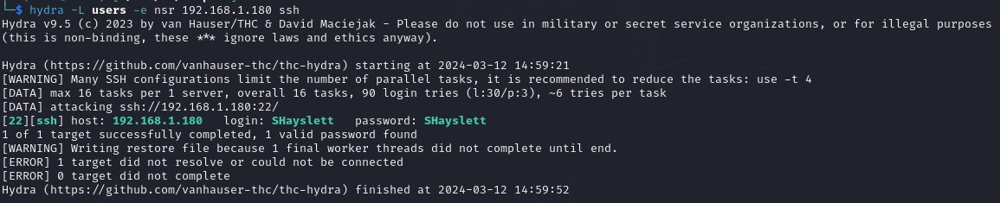
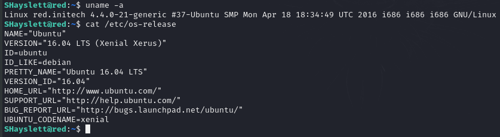
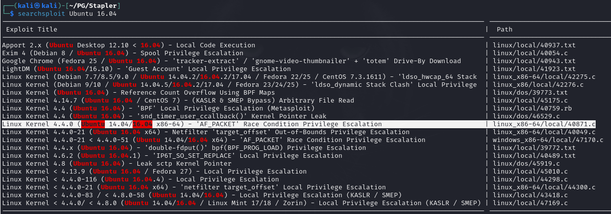

<b>This is a walkthrough of Stapler, an intentionally vulnerable machine from Vulnhub</b>
This is a fairly easy challenge, and I've left out any unnecessary steps. These are the steps I used to go from no access, to a foothold, to root (privilege escalation).

A standard port scan shows several open ports on this machine:

There's a lot to dig into here, but let's check the SMB ports first (these sometimes give up a lot of juicy info).

If we run enum4linux against the target, it returns a lot of information we can use.
We get information about services running on the target, the workgroup name, available shares, and user IDs / SIDs. We'll put these to use in our next step.

We can use grep and cut to extract the usernames to a users file, then use that file with Hydra to attempt to discover ssh credentials. Using -e nsr we're telling Hydra to try the username as the password, try an empty password, and try the username in reverse as the password (no wordlists needed).

We have a set of credentials for SSH, so let's put them to use.

We SSH onto the target. Let's take a look at what this machine is running in terms of OS and kernel versions.

Back over to Kali, let's see if we can find a usable exploit for this OS version.

