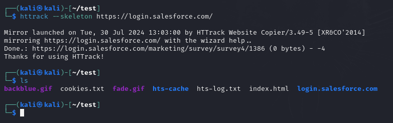

# Anatomy of a Phishing Attack

Phishing attacks are one of the number one vectors used (with great success) to penetrate organizations. These attacks fall under the umbrella of social engineering. Organizations put lots of time, resources, and money into technical security controls and patching, but they seldom patch their greatest vulnerability... employees. Exploiting human behavior is oftentimes much easier than pulling off technical exploits. This is due to human psychology (a topic I personally find very fascinating). If this topic interests you, I recommend reading, _**Social Engineering: The Science of Human Hacking**_.

Social engineering attacks, like Phishing, often leverage fear, people's helpful nature, and urgency (among other things).

Spotting a phishing attack can be tricky, and I won't go into great detail here, but there are some basic telltale signs of a phishing email.

- Correct grammer and spelling in the email is definitely something you want to check for, although with GenAI it is much easier for malicious entities to craft believeable email messages than it used to be.
- Email header information holds a lot of telling signs. Always pay attention to the From address. An email from AT&T customer services shouldn't come from an address like service@att120321zmurnxt32.com.
- Additionaly, the Return Path and Reply To addresses should match the From address. If the email is from customerservice@att.com and the reply goes to service@att120321zmurnxt32.com, that's something you efinitely want to verify.
- If there is a link in the email, hover over it to see the full URL. You can often tell immediately if the link is bogus.

Additionally, you can copy the URL and paste it into one of the tools below to check if the link is associated with a known phishing scam.

[https://checkphish.bolster.ai/](https://checkphish.bolster.ai/)

[https://phishtank.com/](https://phishtank.com/)

[https://www.virustotal.com/](https://www.virustotal.com/)

Before we move on to the actual attack portion, there is one more thing to be aware of. Take a look at the URLs below and see if you can spot the difference.

goоgle.com

google.com

Your eyes are probably bugging out right now, so let me help you out. There is no noticable difference. However, if you copy and paste these domain names ino your browser or a command line, you will not be able to ping or access one of them. Let's try it.

The first name can't be found, but they look exactly alike. Only, they are not. One of the o's in the first example is in Cyrillic, not ASCII. It looks the same but is interpreted differently. Sometimes if you look close you'll notice the subtle differences, but if you're unsure you can use a tool like [https://regex101.com/r/wZo2wB/1](https://regex101.com/r/wZo2wB/1) to verify.

Here we see that the second o in the first string has been identified as a non-ascii character. This technique can be used to spoof email addresses or domains without the victim even realizing it.

Now let's get to the fun stuff.

We'll cover both a manual and automated phishing attack.

For the manual attack, let's pick on Salesforce. Here's their login page.

What we'll do here is scrape this page and alter the back end to send login requests to a web server we control. Let's start with scraping.

We'll use httrack to mirror the site, but we only want html pages, so we'll pass the --skeleton argument.

Now we need to alter the code so that requests come to us. The source files are located in the login.salesforce.com folder. Let's go in there and edit the index.html page.

At first glance this seems intimidating. There is a lot of information here, but we want two parameters (method and action).

Let's start with action. We want to send this request to our web server, which we will set up shortly. Let's overwrite the action here to point to our web server IP and port.

Now for the method. The form is currently using POST, in which data is sent in the body of the response and not vsible in the address bar. We do not want this. We want the username and password to be visible in the address bar. That is how we will capture the credentials. For this we need to change the method to GET.

That's it. We can save and close the file. Then, in the login.salesforce.com folder, we'll start a web server. You can use whatever technology you'd like (Apache, PHP, etc). I like to use Python's simple HTTP server.

Now we just need to get the URL to a user somehow. This is where creativity comes into play. Let's use TinyURL.

If the user clicks our link, they are directed to our webserver, which is serving the spoofed salesforcelogin page.

The URL at this point should be an indication that this is not a genuine link, but lots of people miss this. Let's enter credentials.

Our webserver has captured the login request, including the credentials.

Now let's automate this whole process with a tool called SocialPhish (there are plenty of other tools out there as well).

This tool will spoof the page for us, serve it, and capture the login credentials. We have a lot of options here. We can even generate our own with custom. Let's go with Netflix. Now...I know what you're thinking, “Who cares if someone get's my Netflix credentials”. Credential reuse is why you should care. Most people reuse credentials, so if I get your Netflix credentials, there's a pretty good chance I now also have the credentials to other accounts, including banking.

That said, let's move on. We'll make our selections and change the default port to 8008. We are given a URL to send the target, and the server just sits and waits for someone to connect.

Let's go to another machine and follow the URL.

Notice how the URL remains obfuscated. You don't see a private IP / port. On the back end, the tool give us regional info about the victim who just connected.

Let's enter credentials.

And on the back end...

It not only grabbed the credentials, but it also saved them to a file for later use.

Back on the front end...

The victim is redirected to Netflix.com and is non the wiser.

If we run the URL through Virustotal, we'll see that it is in fact flagged as a potential threat.

