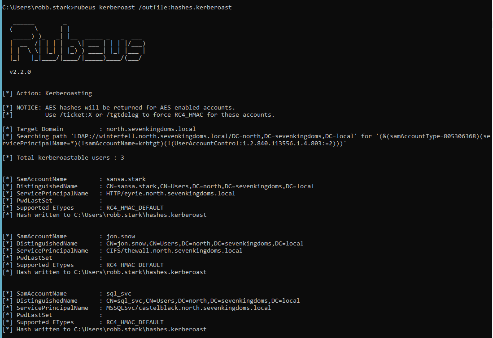
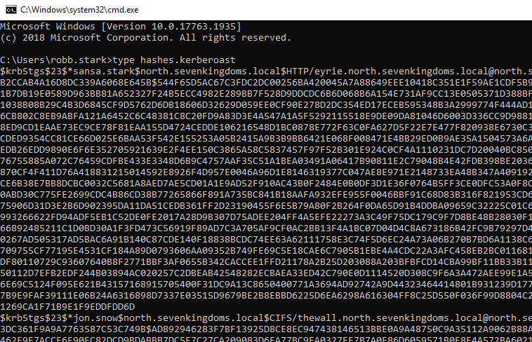

# Kerberoasting

Kerberoasting is an attack that requires elevated privilages to pull off, and it can allow us to move laterally througout a compromised network. This attack takes advantage of the native functionality of Kerberos. To understand the attack, we first need to understand a little about Kerberos and how it works.

When a user wants access to a resource hosted on an SPN (Service Principal Name), they send a request for a service ticket, which is generated by the DC (domain controller) - side note, an SPN is just the unique identifier of a service instance in an Active Directory environment. The service ticket is used for access and is encrypted with the password hash of the SPN. Sounds pretty straightforward and secure, right?

Wrong. There's one little problem here. When requesting a ticket, the DC does not check whether the requesting user has any permissions to access the services hosted by the SPN (at least not up front, these checks are performed as a second step when connecting to the actual service). Also, keep in mind that SPN accounts tend to have elevated privileges.

Do you see the problem here? An opportunity for an attacker?

If we request a ticket on behalf of a user, the DC will provide the service ticket to us. From here we can extract the hash and potentially crack the password offline, giving us access to the actual service account.

Let's give it a try.

The simplest way to do this is with a tool called Rubeus. There are several ways to get this tool onto our target. I like to use powershell.

Once we have Rubeus on the target, all we need to do is run its kerberoasting command.

Running this command has not only given us a sql service account hash, but we also have the hash of two network accounts (who apparantly have SPNs associated with them). The hashes have been output to a file called hashes.kerberoast.

We can type this file as output to view the hashes.

And that's all there is to it. From here, we copy the hashes onto our system and get cracking.

