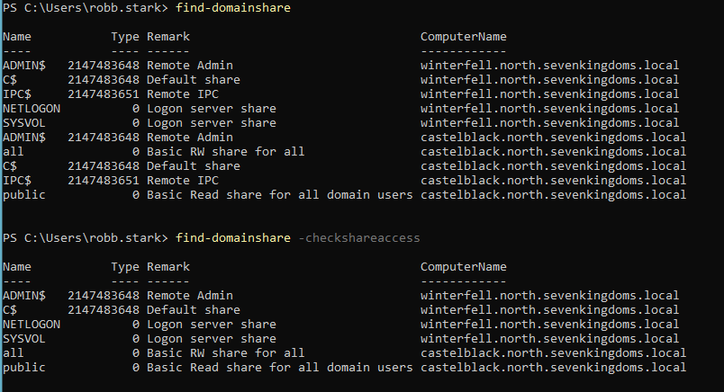
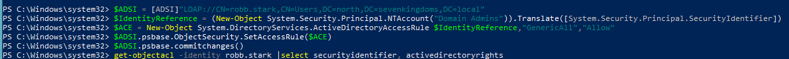
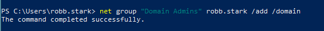

# Using PowerView to gather domain intel

In a previous article titled, DC takeover via Insecure Web Upload, we looked at gaining access to a DC within a domain. What we're about to look at here would be a next step once you have that access and need to gain situational awareness / an understanding of the environment.

NOTE: This is not an exhaustive explaination about how to use PowerView or gain domain intel. The purpose here is to provide a foundation to build upon. There is a lot of digging that can be done with this tool.

Using the same techniques as in the previous article, we'll pull PowerView over to our target.

_PowerView is a powershell enumeration tool for domain recon. It can be used by security professionals to gather information about a their domain. It can also be used by attackers to gain a better understanding of a target domain and map out attacks (as we will soon see)._

Now that we have PowerView on our target, let's load it and put it to use.

We'll start by importing the module.

We get an error message. Powershell is picky about file location. In order to load our script, we need to provdide the current working directory in ./ format.

Ok, PowerView is loaded. We can now execute PowerView commands directly within powershell. Let's start by getting some basic information about the domain we are connected to.

Here we have the forest, the DC (domain controller), roles, and the domainmodelevel.

Now let's discover users in the domain.

We get a decent list of users with lots of information, but from here on out we'll be using powershell select statements to return cleaner output, and get exactly what we want in terms of intel.

Let's return only the list of usernames.

Much better. Now we have a clean list of login IDs for all accounts in the network. From here creativity and technique really start coming into play. Let's navigate our way around not as a security professional, but as an attacker, looking for anything we can take advantage of.

Let's take a look at the description field of the users we discovered. Sometimes this field is populated with information that could be helpful.

We have a password for Samwell Tarly. This is an intentionally vulnerable AD environment. We shouldn't see something this blatant in reality, but you never know.

Let's see what groups are in this domain.

There are a lot of groups here, but let's take a look at Domain Admins (which is at the bottom of the list and doesn't appear in the screenshot). Let's see who the members of this group are.

Based on the previous output, Eddard Stark is a big target as access to this account will grant us full domain control.

Let's take a look at computer accounts.

We've got 2 machines, both Windows 2019 Datacenter Servers (this is just a lab environment, a full domain would yeild much more in terms of results).

Let's check and see if there are any shares available on the network, and if so, what are the permissions?

There are 2 commands that we just ran. The first is listing all available network shares. The second is listing only the shares that our account has access to.

Now, let's take a look at the object ACLs within our environment.

There are a few things here that we'll want to investigate further, GenericAll, WriteProperty, WriteDacl, and WriteOwner rights.

- GenericAll is a permission that grants full rights to an Active Directory object
- WriteOwner is an permission that grants the ability to change the owner of an object
- WriteProperty Rights refer to the permissions that allow a user or group to modify or change the properties of an AD object, such as a user, group, or computer
- WriteDACL is apermission that allows an attacker to modify the access control entries (ACEs) of an object

Now we need to figure out, what are these objects that we have these permissions to?

We have the SID (security identifier), but we need to know what these SIDs map to. What is the human-readable name of these particular objects? We can find that with **convert-sidtoname**

Based on the output above, we have access to edit the permissions of both the Domain Admins and Enterprise Admins groups (which we are not even a member of).

From this point we have a few options. We could target Eddard Stark's account for domain admin access, we could check out the available shares, we could try logging in as Samwell Tarly, we could take all the accounts we discovered and build a users list and then spray Samwell's password against those accounts to see if there is password resuse in the environment.

Or... we could try to take advantage of of Domain Admin's ACLs. Let's go this route.

We want to see if we can add ourselves to the Domain Admins group, given that we have WriteOwner and WriteDACL access.

First, we'll need to switch to an elevated powershell prompt and re-import PowerView.

Next we'll issue the following commands, which will use our WriteOwner and WriteDACL privileges to grant ourselves GenericAll access to the Domain Admins group. Therefore granting us full control over this group.

Now, let's check our ACL permissions again.

We now have full control over Domain Admins.

However, we still are not members of this group.

Let's add ourself to the Domain Admins group.

Now we'll verify that we are a domain admin.

We own this domain!

